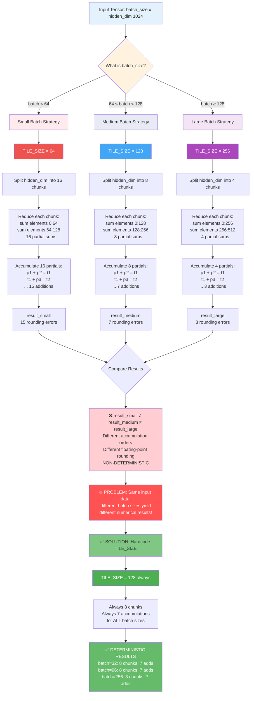

# NKI Batch Invariance Test

Demonstrating batch invariance principles in NKI (Neuron Kernel Interface), replicating findings from [Thinking Machines' "Defeating Nondeterminism in LLM Inference"](https://thinkingmachines.ai/blog/defeating-nondeterminism-in-llm-inference/).

## What is Batch Invariance?

**Batch invariance** means that computing the same element in different batch sizes produces **identical numerical results**. The paper demonstrates that CUDA/PyTorch matrix multiplication is **NOT batch-invariant** due to dynamic optimization strategies that change based on batch size.

## When Does Batch Variance Occur?

Batch variance occurs when **ALL THREE conditions are met**:

1. **Tiling the reduction dimension** (not parallelizable dimensions)
   - MatMul: Tiling K (contraction dimension) ✓
   - RMSNorm: Tiling hidden dimension in split reduction ✓

2. **Iterative accumulation across tiles** (not atomic reductions)
   - `c_psum += matmul(a_tile, b_tile)` ✓ Creates variance
   - `nl.sum(entire_row)` ✗ Atomic, no variance

3. **Dynamic tile size based on input characteristics**
   - CUDA: Adapts K strategy based on batch size ✓
   - NKI (fixed): `K_TILE = 128` always ✗
   - NKI (variant): `K_TILE = 64 if K <= 512 else 128` ✓


## Test Environment

- **Instance**: `inf2.xlarge` (AWS Trainium)
- **AMI ID**: `ami-0ec4ab14b1c5a10f2`
- **AMI Name**: `Deep Learning AMI Neuron (Ubuntu 22.04) 20250919` 
- **Compiler**: `neuronxcc-2.21.18209.0`
- **Framework**: NKI (Neuron Kernel Interface)

## Test Suite Overview

We test three kernel implementations:

1. **MatMul with K_TILE variation** - Demonstrates reduction dimension tiling variance
2. **RMSNorm (standard)** - Demonstrates natural batch invariance with atomic reductions
3. **RMSNorm (split reduction)** - Demonstrates hidden dimension tiling variance

Each test compares:
- **Invariant mode**: Fixed tile size (batch-invariant)
- **Variant mode**: Adaptive tile size (batch-variant)
- **Precision impact**: bfloat16 vs float32

## Results

### Test 1: MatMul - K_TILE Variance

**Configuration**: M=128, K=512, N=512

```
bfloat16:
  K_TILE=128 (invariant):  4 accumulations over K dimension
  K_TILE=64  (variant):    8 accumulations over K dimension
  Max difference: 0.007812
  Result: DIFFER ✓

float32:
  K_TILE=128 (invariant):  4 accumulations
  K_TILE=64  (variant):    8 accumulations
  Max difference: 0.000050
  Result: DIFFER ✓

Precision impact: bfloat16 error is 157x larger than float32
```

**Key Finding**: Different K_TILE sizes create different accumulation orders in the reduction:
- K_TILE=128: `((chunk0 + chunk1) + chunk2) + chunk3` (4 tiles)
- K_TILE=64: `(((((((ch0 + ch1) + ch2) + ch3) + ch4) + ch5) + ch6) + ch7)` (8 tiles)

Due to floating-point associativity: `(a + b) + c ≠ a + (b + c)`

### Test 2: RMSNorm (Standard) - Natural Batch Invariance

**Configuration**: batch_size varies, hidden_dim=256

```
Same 32 rows computed in:
  - batch=32 context
  - batch=128 context

Result: MATCH ✓ (identical)
Max difference: 0.0
```

**RMSNorm remains batch-invariant UNTIL you:**
- Tile the **hidden dimension** (the reduction axis) instead of the batch dimension
- Make that tile size **dynamic** based on input characteristics
- Use **iterative accumulation** across hidden dimension chunks (see Test 3 for this scenario)

### Test 3: RMSNorm (Split Reduction) - Hidden Dimension Tiling Variance

**Configuration**: batch_size=64, hidden_dim=512

```
bfloat16:
  HIDDEN_TILE=256 (invariant):  2 chunks, 1 accumulation
  HIDDEN_TILE=128 (variant):    4 chunks, 3 accumulations
  Max difference: 0.007812
  Result: DIFFER ✓

float32:
  HIDDEN_TILE=256 (invariant):  2 chunks, 1 accumulation
  HIDDEN_TILE=128 (variant):    4 chunks, 3 accumulations
  Max difference: 0.000000
  Result: IDENTICAL

Precision impact: Variance only visible in bfloat16 for this test
```

**Key Finding**: Split reduction creates variance by tiling the **reduction dimension** (hidden_dim):
- Standard RMSNorm: `nl.sum(row)` - atomic, invariant
- Split RMSNorm: `sum(chunk0) + sum(chunk1) + sum(chunk2) + sum(chunk3)` - iterative, variant

**Important**: Float32 precision may be sufficient to make simple addition accumulation errors negligible, unlike multiply-accumulate in MatMul.

## Key Findings

### 🎯 Core Principle: Reduction Dimension Tiling Creates Variance

**Operations are naturally batch-invariant UNTIL:**

1. ✅ You tile the **reduction dimension** (not parallelizable dimensions)
2. ✅ Tile size changes **dynamically** based on input characteristics  
3. ✅ Operation uses **iterative accumulation** (not atomic reductions)

**Examples:**
- ❌ **No variance**: RMSNorm batch tiling - tiles parallelizable dimension (batch)
- ✅ **Creates variance**: MatMul K tiling - tiles reduction dimension with accumulation
- ✅ **Creates variance**: RMSNorm split reduction - tiles hidden dimension with accumulation

### 📊 Precision Amplifies Variance

| Operation | bfloat16 Error | float32 Error | Amplification |
|-----------|---------------|---------------|---------------|
| MatMul (K_TILE) | 0.007812 | 0.000050 | **157x** |
| RMSNorm Split (HIDDEN_TILE) | 0.007812 | ~0.000000 | Only visible in bfloat16 |

**Critical Insight**: Reduced precision (bfloat16) amplifies tiling variance dramatically:
- **Multiply-accumulate** (MatMul): Errors compound quickly, visible in both precisions
- **Pure addition** (RMSNorm sum): Errors compound slowly, only visible in bfloat16
- **Implication**: bfloat16 sees more extreme batch variance

### 🔬 Replicating Paper Findings with NKI

Our results directly replicate [Thinking Machines' findings](https://thinkingmachines.ai/blog/defeating-nondeterminism-in-llm-inference/):

**Paper's observation (CUDA):**
> "CUDA adapts K reduction strategy based on batch size, causing non-determinism"

**Our NKI implementation:**
```python
# Batch-variant: Mimics CUDA's dynamic strategy
K_TILE = 64 if K <= 512 else 128

# Batch-invariant: Fixed strategy (paper's solution)
K_TILE = 128  # Always
```

**Result**: Same variance pattern observed in NKI when we explicitly code dynamic tiling, confirming the paper's root cause analysis.

### 🛡️ NKI's Natural Protection

**Why NKI tends toward batch-invariance:**

1. **Hardware constraints enforce constants**
   - Tensor Engine limits: P-dim ≤ 128, free-dim ≤ 512
   - Encourages fixed compile-time tile sizes
   - Makes dynamic adaptation less natural

2. **Explicit control over tiling**
   - Developers explicitly set K_TILE, HIDDEN_TILE, etc.
   - No "magic" runtime optimization that varies strategy
   - Batch-invariance is default unless explicitly coded otherwise

3. **Atomic operations where possible**
   - `nl.sum(entire_dimension)` is atomic - naturally invariant
   - Only manual tiling creates variance

## Implications for LLM Inference

### ✅ Benefits

1. **Deterministic inference** - Same outputs for temperature=0 sampling regardless of batch size
2. **On-policy RL** - Training and inference produce identical numerics
3. **Debugging** - Reproducible results across batch sizes simplifies debugging
4. **Cache coherence** - KV-cache values identical whether computed individually or batched

### ⚠️ Requirements for Batch-Invariance

1. **Fix reduction tile sizes**
   ```python
   # ❌ BAD: Dynamic tiling
   K_TILE = 64 if K <= 512 else 128
   
   # ✅ GOOD: Fixed tiling
   K_TILE = 128  # Always
   ```

2. **Use consistent precision**
   - bfloat16 shows 157x larger variance than float32
   - Mixed precision can break invariance

3. **Avoid split reductions when possible**
   - Prefer atomic reductions: `nl.sum(entire_dimension)`
   - If split necessary, use fixed tile sizes

## Conclusion

NKI naturally encourages batch-invariant implementations through:
- Hardware-enforced tile size constraints
- Explicit tiling control (no magic runtime optimization)
- Atomic reduction operations as primitives

However, variance can still occur when:
- Manually implementing split reductions with dynamic tile sizes
- Using reduced precision (bfloat16) with iterative accumulation
- Adapting strategies based on input characteristics

**My findings directly replicate the Thinking Machines paper**: Batch variance stems from **dynamic tiling of reduction dimensions**, and the solution is **fixed tiling strategies**. NKI makes this easier by design, but developers must still be intentional about tile size choices, especially when using bfloat16 precision.

## Running the Tests

```bash
cd contributed/batch_invariance
python test_batch_invariance.py
```

**Expected Output:**
```
================================================================================
Testing MatMul batch invariance...
  Testing with bfloat16:
    Max difference between K_TILE strategies: 0.007812
    Results differ
  Testing with float32:
    Max difference between K_TILE strategies: 0.000050
    Results differ
  Precision impact: bfloat16 error is 157x larger than float32

================================================================================
Testing RMSNorm batch invariance...
  First 32 rows: batch=32 vs batch=128: MATCH ✓
  ✓ RMSNorm is batch-invariant!

================================================================================
Testing RMSNorm with Split Reduction...
  Testing with bfloat16:
    Max difference between HIDDEN_TILE strategies: 0.007812
    Results differ
  Testing with float32:
    Max difference between HIDDEN_TILE strategies: 0.000000
    Results identical
```

## Files

- `kernels/matmul_batch_invariant.py` - MatMul with configurable K_TILE
- `kernels/rmsnorm_batch_invariant.py` - Standard RMSNorm (atomic reduction)
- `kernels/rmsnorm_split_reduction.py` - RMSNorm with split reduction (demonstrates variance)
- `test_batch_invariance.py` - Comprehensive test suite
- `README.md` - This document

## References

- [Thinking Machines: Defeating Nondeterminism in LLM Inference](https://thinkingmachines.ai/blog/defeating-nondeterminism-in-llm-inference/)
- [AWS Neuron Documentation](https://awsdocs-neuron.readthedocs-hosted.com/)
- [NKI Programming Guide](https://awsdocs-neuron.readthedocs-hosted.com/en/latest/general/nki/)
