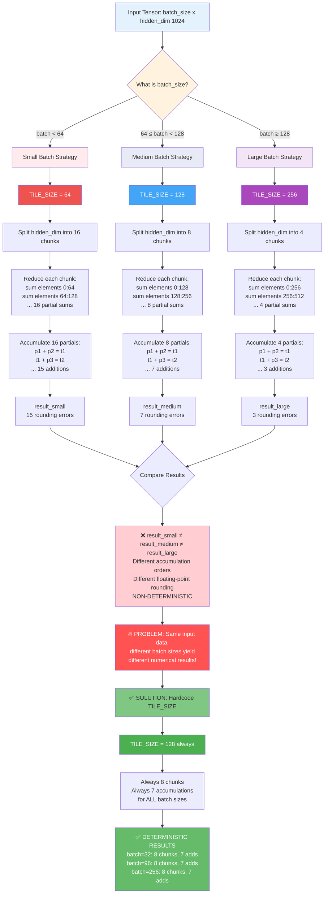

# NKI Batch Invariance Test

Demonstrating batch invariance principles in NKI (Neuron Kernel Interface), replicating findings from [Thinking Machines' "Defeating Nondeterminism in LLM Inference"](https://thinkingmachines.ai/blog/defeating-nondeterminism-in-llm-inference/).

## What is Batch Invariance?

**Batch invariance** means that computing the same element in different batch sizes produces **identical numerical results**. The paper demonstrates that CUDA/PyTorch matrix multiplication is **NOT batch-invariant** due to dynamic optimization strategies that change based on batch size.

## When Does Batch Variance Occur?

Batch variance occurs when **ALL THREE conditions are met**:

1. **Tiling the reduction dimension** (not parallelizable dimensions)
   - MatMul: Tiling K (contraction dimension) ✓
   - RMSNorm: Tiling hidden dimension in split reduction ✓

2. **Iterative accumulation across tiles** (not atomic reductions)
   - `c_psum += matmul(a_tile, b_tile)` ✓ Creates variance
   - `nl.sum(entire_row)` ✗ Atomic, no variance

3. **Dynamic tile size based on input characteristics**
   - CUDA SplitK: Adapts K strategy based on batch size ✓
   - NKI (fixed): `K_TILE = 128` always ✗
   - NKI (variant): `K_TILE = 64 if K <= 512 else 128` ✓


## Test Environment

- **Instance**: `inf2.xlarge` (AWS Trainium)
- **AMI ID**: `ami-0ec4ab14b1c5a10f2`
- **AMI Name**: `Deep Learning AMI Neuron (Ubuntu 22.04) 20250919` 
- **Compiler**: `neuronxcc-2.21.18209.0`
- **Framework**: NKI (Neuron Kernel Interface)

## Test Suite Overview

We test four kernel implementations:

1. **MatMul Lang (nl.matmul)** - High-level NKI API with K_TILE variation
2. **MatMul ISA (nisa.nc_matmul)** - Low-level ISA implementation with K_TILE variation
3. **RMSNorm (standard)** - Demonstrates natural batch invariance with atomic reductions
4. **RMSNorm (split reduction)** - Demonstrates hidden dimension tiling variance

Each test compares:
- **Invariant mode**: Fixed tile size (batch-invariant)
- **Variant mode**: Adaptive tile size (batch-variant)
- **Precision impact**: bfloat16 vs float32
- **Quantization threshold effects**: When float32 errors fall below bfloat16's representable precision

## Results

### Test 1a: MatMul Lang (nl.matmul) - K_TILE Variance

**Configuration**: M=256, K=512, N=512

```
bfloat16:
  K_TILE=128 (invariant):  4 accumulations over K dimension
  K_TILE=64  (variant):    8 accumulations over K dimension
  Max difference: 0.007812
  Result: DIFFER ✓

float32:
  K_TILE=128 (invariant):  4 accumulations
  K_TILE=64  (variant):    8 accumulations
  Max difference: 0.000046
  Result: DIFFER ✓

Precision impact: bfloat16 error is 170x larger than float32
```

**Key Finding**: Different K_TILE sizes create different accumulation orders in the reduction:
- K_TILE=128: `((chunk0 + chunk1) + chunk2) + chunk3` (4 tiles)
- K_TILE=64: `(((((((ch0 + ch1) + ch2) + ch3) + ch4) + ch5) + ch6) + ch7)` (8 tiles)

Due to floating-point associativity: `(a + b) + c ≠ a + (b + c)`

### Test 1b: MatMul ISA (nisa.nc_matmul) - K_TILE Variance with Quantization Erasure

**Configuration**: M=256, K=512, N=512

```
bfloat16:
  K_TILE=128 (invariant):  4 accumulations over K dimension
  K_TILE=64  (variant):    8 accumulations over K dimension
  Max difference: 0.000000
  Result: IDENTICAL ✓

float32:
  K_TILE=128 (invariant):  4 accumulations
  K_TILE=64  (variant):    8 accumulations
  Max difference: 0.000061
  Result: DIFFER ✓

Precision impact: bfloat16 error is 0x smaller than float32 (error erased by quantization)
```

**Critical Discovery**: When float32 errors fall below bfloat16's quantization threshold (~0.008), quantization **erases** the differences rather than amplifying them:

- **Lang kernel**: Float32 error (0.000046) crosses quantization threshold → bfloat16 amplifies to 0.007812 (170x)
- **ISA kernel**: Float32 error (0.000061) stays below threshold → bfloat16 quantizes both results identically (0.000000)

**Why This Happens**:
1. Both kernels accumulate in float32 internally
2. Final output is quantized to bfloat16
3. When float32 differences are sub-threshold:
   - Both results round to the **same bfloat16 value**
   - The error doesn't compound—it **vanishes**
4. ISA-level matmul has superior numerical stability, producing smaller float32 errors

**Implication**: The ISA kernel's tighter numerical precision keeps K-tiling errors below bfloat16's representable range, making it more robust to batch size variations in reduced precision.

### Test 2: RMSNorm (Standard) - Natural Batch Invariance

**Configuration**: batch_size varies, hidden_dim=256

```
Same 32 rows computed in:
  - batch=32 context
  - batch=128 context

Result: MATCH ✓ (identical)
Max difference: 0.0
```

**RMSNorm remains batch-invariant UNTIL you:**
- Tile the **hidden dimension** (the reduction axis) instead of the batch dimension
- Make that tile size **dynamic** based on input characteristics
- Use **iterative accumulation** across hidden dimension chunks (see Test 3 for this scenario)

### Test 3: RMSNorm (Split Reduction) - Hidden Dimension Tiling Variance

**Configuration**: batch_size=64, hidden_dim=512

```
bfloat16:
  HIDDEN_TILE=256 (invariant):  2 chunks, 1 accumulation
  HIDDEN_TILE=128 (variant):    4 chunks, 3 accumulations
  Max difference: 0.007812
  Result: DIFFER ✓

float32:
  HIDDEN_TILE=256 (invariant):  2 chunks, 1 accumulation
  HIDDEN_TILE=128 (variant):    4 chunks, 3 accumulations
  Max difference: 0.000000
  Result: IDENTICAL

Precision impact: Variance only visible in bfloat16 for this test
```

**Key Finding**: Split reduction creates variance by tiling the **reduction dimension** (hidden_dim):
- Standard RMSNorm: `nl.sum(row)` - atomic, invariant
- Split RMSNorm: `sum(chunk0) + sum(chunk1) + sum(chunk2) + sum(chunk3)` - iterative, variant

**Important**: Float32 precision may be sufficient to make simple addition accumulation errors negligible, unlike multiply-accumulate in MatMul.

## Key Findings

### 🎯 Core Principle: Reduction Dimension Tiling Creates Variance

**Operations are naturally batch-invariant UNTIL:**

1. ✅ You tile the **reduction dimension** (not parallelizable dimensions)
2. ✅ Tile size changes **dynamically** based on input characteristics  
3. ✅ Operation uses **iterative accumulation** (not atomic reductions)

**Examples:**
- ❌ **No variance**: RMSNorm batch tiling - tiles parallelizable dimension (batch)
- ✅ **Creates variance**: MatMul K tiling - tiles reduction dimension with accumulation
- ✅ **Creates variance**: RMSNorm split reduction - tiles hidden dimension with accumulation

### 📊 Precision Effects: Amplification vs Erasure

| Operation | float32 Error | bfloat16 Error | Amplification | Effect |
|-----------|---------------|----------------|---------------|--------|
| MatMul Lang (nl.matmul) | 0.000046 | 0.007812 | **170x** | Amplified |
| MatMul ISA (nisa.nc_matmul) | 0.000061 | 0.000000 | **0x** | Erased |
| RMSNorm Split (HIDDEN_TILE) | 0.000000 | 0.007812 | **21845x** | Amplified |

**Critical Insight**: Bfloat16 has **two distinct behaviors** depending on float32 error magnitude:

1. **Above quantization threshold (~0.008)**: Errors are **amplified**
   - Lang MatMul: 0.000046 → 0.007812 (170x amplification)
   - RMSNorm: 0.000000 → 0.007812 (21845x amplification)
   - Different accumulation orders produce distinguishable bfloat16 values

2. **Below quantization threshold (~0.008)**: Errors are **erased**
   - ISA MatMul: 0.000061 → 0.000000 (quantization erasure)
   - Both K_TILE strategies round to identical bfloat16 values
   - Variance becomes invisible in reduced precision

**Why This Matters**:
- **Multiply-accumulate** (MatMul): Errors compound quickly, may cross threshold
- **Pure addition** (RMSNorm sum): Errors compound slowly, typically crosses threshold
- **ISA-level operations**: Superior numerical stability keeps errors sub-threshold
- **Implication**: Kernel implementation quality determines whether bfloat16 amplifies or erases tiling variance

### 🔬 Replicating Paper Findings with NKI

Our results directly replicate [Thinking Machines' findings](https://thinkingmachines.ai/blog/defeating-nondeterminism-in-llm-inference/):

**Paper's observation (CUDA):**
> "CUDA adapts K reduction strategy based on batch size, causing non-determinism"

**Our NKI implementation:**
```python
# Batch-variant: Mimics CUDA's dynamic strategy
K_TILE = 64 if K <= 512 else 128

# Batch-invariant: Fixed strategy (paper's solution)
K_TILE = 128  # Always
```

**Result**: Same variance pattern observed in NKI when we explicitly code dynamic tiling, confirming the paper's root cause analysis.

### 🛡️ NKI's Natural Protection

**Why NKI tends toward batch-invariance:**

1. **Hardware constraints enforce constants**
   - Tensor Engine limits: P-dim ≤ 128, free-dim ≤ 512
   - Encourages fixed compile-time tile sizes
   - Makes dynamic adaptation less natural

2. **Explicit control over tiling**
   - Developers explicitly set K_TILE, HIDDEN_TILE, etc.
   - No "magic" runtime optimization that varies strategy
   - Batch-invariance is default unless explicitly coded otherwise

3. **Atomic operations where possible**
   - `nl.sum(entire_dimension)` is atomic - naturally invariant
   - Only manual tiling creates variance

4. **ISA-level numerical stability**
   - Low-level ISA instructions (`nisa.nc_matmul`) exhibit superior numerical precision
   - Tighter error bounds keep float32 differences below bfloat16's quantization threshold
   - Quantization can erase tiling variance entirely in reduced precision
   - Makes ISA kernels naturally more robust to batch size variations
   - However, variance still exists in float32—testing in both precisions is essential

## Implications for LLM Inference

### ✅ Benefits

1. **Deterministic inference** - Same outputs for temperature=0 sampling regardless of batch size
2. **On-policy RL** - Training and inference produce identical numerics
3. **Debugging** - Reproducible results across batch sizes simplifies debugging
4. **Cache coherence** - KV-cache values identical whether computed individually or batched

### ⚠️ Requirements for Batch-Invariance

1. **Fix reduction tile sizes**
   ```python
   # ❌ BAD: Dynamic tiling
   K_TILE = 64 if K <= 512 else 128
   
   # ✅ GOOD: Fixed tiling
   K_TILE = 128  # Always
   ```

2. **Use consistent precision**
   - bfloat16 shows 157x larger variance than float32
   - Mixed precision can break invariance

3. **Avoid split reductions when possible**
   - Prefer atomic reductions: `nl.sum(entire_dimension)`
   - If split necessary, use fixed tile sizes

## Conclusion

NKI naturally encourages batch-invariant implementations through:
- Hardware-enforced tile size constraints
- Explicit tiling control (no magic runtime optimization)
- Atomic reduction operations as primitives

However, variance can still occur when:
- Manually implementing split reductions with dynamic tile sizes
- Using reduced precision (bfloat16) with iterative accumulation
- Adapting strategies based on input characteristics

**Key findings that extend the Thinking Machines paper**:

1. **Batch variance stems from dynamic tiling of reduction dimensions** (confirmed)
2. **Fixed tiling strategies solve the problem** (confirmed)
3. **NEW: Quantization threshold effect** - Bfloat16 doesn't always amplify errors:
   - When float32 errors exceed ~0.008: Amplification occurs (170-21845x)
   - When float32 errors stay below ~0.008: Quantization erases differences entirely
   - ISA-level kernels with superior numerical stability can stay sub-threshold
   - This makes some implementations naturally robust to batch variance in bfloat16

**Practical Implications**:
- High-quality kernel implementations (ISA-level) may hide batch variance in bfloat16
- This can create false confidence—variance still exists in float32
- Testing in float32 is essential to detect underlying numerical instability
- Don't rely on bfloat16 testing alone to validate batch invariance

## Running the Tests

```bash
cd contributed/batch_invariance
python test_batch_invariance.py
```

**Expected Output:**
```
================================================================================
Testing MatMul Correctness...
  Lang kernel (nl.matmul): ✓ Matches PyTorch reference
  ISA kernel (nisa.nc_matmul): ✓ Matches PyTorch reference

================================================================================
Testing MatMul batch variance (Lang kernel)...
  Testing with float32:
    Max difference between K_TILE strategies: 0.000046
    Results differ
  Testing with bfloat16:
    Max difference between K_TILE strategies: 0.007812
    Results differ
  Precision impact: bfloat16 error is 170x larger than float32

================================================================================
Testing MatMul batch variance (ISA kernel)...
  Testing with float32:
    Max difference: 0.000061
    Results differ
  Testing with bfloat16:
    Max difference: 0.000000
    Results identical
  Precision impact: bfloat16 error is 0x smaller than float32
  Note: Float32 error (0.000061) is below bfloat16 quantization threshold (~0.008)
        Quantization erases the difference rather than amplifying it

================================================================================
Testing RMSNorm batch invariance...
  First 32 rows: batch=32 vs batch=128: MATCH ✓
  ✓ RMSNorm is batch-invariant!
  Each row computed independently, reduction is atomic

================================================================================
Testing RMSNorm batch variance...
  Max difference between HIDDEN_TILE strategies: 0.007812
  Results differ
  ✗ Different HIDDEN_TILE sizes produce different results

================================================================================
Testing RMSNorm HIDDEN_TILE variance...
  Testing with bfloat16:
    Max difference between HIDDEN_TILE strategies: 0.007812
    Results differ
  Testing with float32:
    Max difference between HIDDEN_TILE strategies: 0.000000
    Results identical
  Precision impact: bfloat16 error is 21845x larger than float32

================================================================================
SUMMARY
MatMul & RMSNorm Batch Variance Results:
kernel                  float32_error  bfloat16_error  amplification
Lang (nl.matmul)        4.577637e-05   0.007812        170.666667
ISA (nisa.nc_matmul)    6.103516e-05   0.000000        0.000000
RMSNorm (HIDDEN_TILE)   3.576279e-07   0.007812        21845.333333
```

## Files

- `kernels/matmul_batch_invariant.py` - MatMul with configurable K_TILE
- `kernels/rmsnorm_batch_invariant.py` - Standard RMSNorm (atomic reduction)
- `kernels/rmsnorm_split_reduction.py` - RMSNorm with split reduction (demonstrates variance)
- `test_batch_invariance.py` - Comprehensive test suite
- `README.md` - This document

## References

- [Thinking Machines: Defeating Nondeterminism in LLM Inference](https://thinkingmachines.ai/blog/defeating-nondeterminism-in-llm-inference/)
- [AWS Neuron Documentation](https://awsdocs-neuron.readthedocs-hosted.com/)
- [NKI Programming Guide](https://awsdocs-neuron.readthedocs-hosted.com/en/latest/general/nki/)
